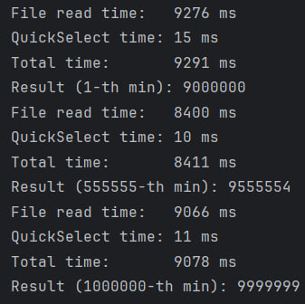
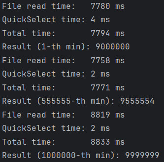
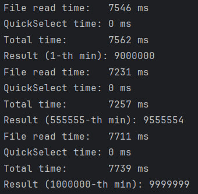

# XLSX N-th Min Finder

Сервис на Spring Boot. Принимает путь к локальному `.xlsx` файлу, берёт числа из первого столбца и возвращает N-ое минимальное уникальное число (элемент, который стоял бы на позиции N, если отсортировать по возрастанию).

---

## Требования
- Java 21
- Интернет
- (опционально) Docker, если запускать в контейнере

---

## Вариант 1: запуск через Gradle

```bash
./gradlew bootRun
```

## Вариант 2: запуск через Docker

```bash
docker build -t min-finder .
docker run -p 8080:8080 -v ${PWD}/test-data:/data min-finder
```

---

После запуска приложение будет доступно по адресу:

http://localhost:8080

Swagger UI:

http://localhost:8080/swagger-ui/index.html

---

## Пример запроса

GET http://localhost:8080/api/v1/finder/min-nth?path=C:\temp\test.xlsx&n=3

где:
- `path` - абсолютный путь к xlsx файлу на вашей машине
- `n` - порядковый номер минимального числа (1 = минимальное, 2 = второе минимальное и т.д.)

Для удобства тестирования в директории `test-data` лежит файл `test.xlsx` с 100 000 элементов (от 10.000.000 до 9.900.000, в порядке убывания).

При запуске через Docker, путь к файлу будет `/data/test.xlsx`.

---
[java](src/main/java)
## Summary

Для поиска минимального элемента используется модифицированный алгоритм Quick Select. 
- `best/average case` - O(n)
- `worst case` - O(n^2) (на практике почти невозможно достичь)

Добавил логирование времени, в среднем на сам алгоритм уходит 1-3мс при 100.000 элементов. На парсинг файла (примитивный) уходит в разы больше - в ТЗ было указано сделать упор в скорость самого алгоритма поиска и не тратить много времени на само тестовое задание. Но я бы конечно поменял подход к парсингу файла, если бы конечное использование алгоритма на самом деле тербовало бы парсинг.

Так же не помешало бы добавить обработчик исключений адекватный, но опять таки, в ТЗ было указано не тратить время на доп. функционал.

---

## Правки

Для удаления дубликатов, теперь считываю Excel файлик в Set, вместо List. По памяти выходит чуть больше, но если взять кейс, в котором в файле часто встречаются дубликаты, то затраты по памяти наоборот скорее уменьшатся.

Я упоминал выше, что чуть модифицировал алгоритм Quick Select - переделал метод поиска опорного элемента, в искомой версии использовался случайный метод поиска опорного элемента, я выбрал чуть другой, но на больших и упорядоченных данных мой алгоритм работает в теории чуть хуже, т.к. опорный элемент всегда выпадает на край диапазона. Но т.к. я теперь использую HashSet, данные не только становятся уникальными, но еще и перемешиваются заодно, поэтому решил остаться на таком подходе.

Вынес конвертацию Set в массив из класса QuickSelect в сервис, теперь QuickSelect принимает сразу массив (на мой взгляд, чуть более универсально), ну и перевод сделал не через стрим, а обычным копированием по итератору.

И чуть переделал сам метод разделения массива - возвращаю правую часть, вместо левой, убрал метод swap - теперь он в самом методе, и вместо деления на 2 использую побитовый сдвиг.

Тестовый файл расширил до 1.000.000 строк, от 10.000.000 до 9.000.000 - чтобы тесты чуть более наглядными были.

По итогу данные такие (1кк элементов) -

**До правок**



**Вынес перевод List в массив из метода рассчётов**



**Использование Set, оптимизация partition. Конечный результат**


